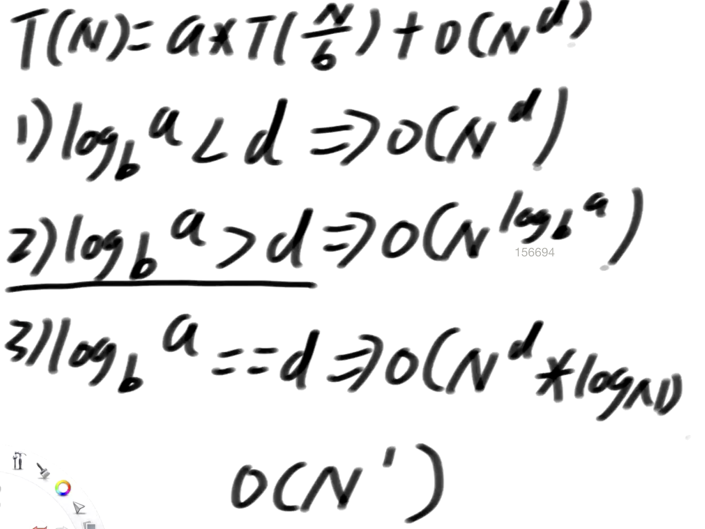

## 题目

- 单链表和双链表如何反转
- 把给定值都删除

- 栈和队列的实现

  - 双向链表实现
  - 数组实现

- 实现一个特殊的栈，在基本功能的基础上，再实现返回栈中最小元素的功能

  - pop, push, getMin 操作的时间复杂度都是 O(1)
  - 设计的栈类型可以使用现成的栈结构

- 如何用栈结构实现队列
- 如何用队列结构实现栈

- 递归
- 递归函数结构要一样
- 画图

- Master 公式 分析递归函数的时间复杂度

  - 子问题的规模是一致的 就能用公式

  

- 哈希表和有序表